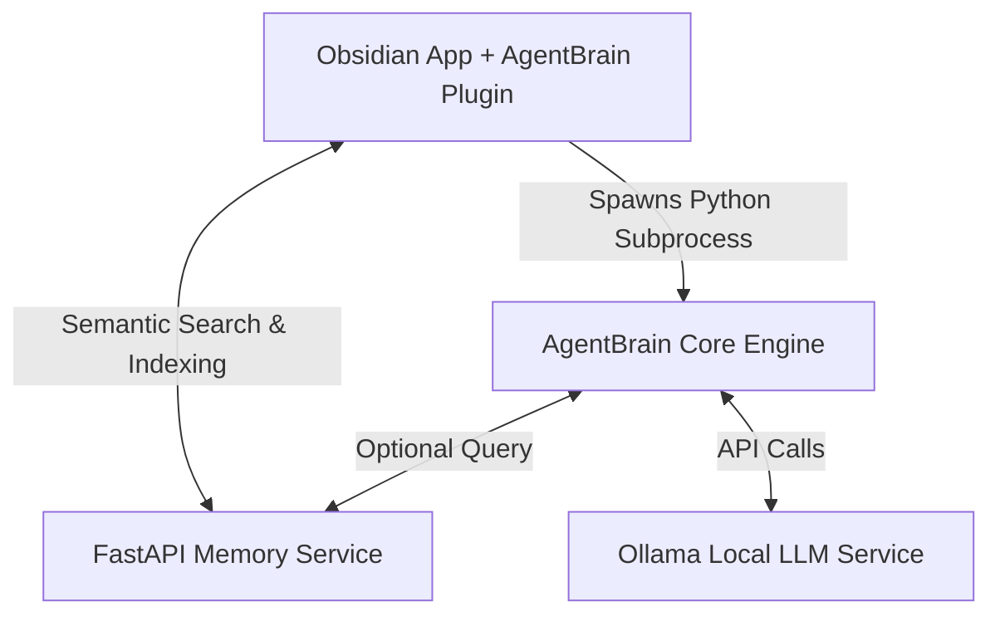

# 🧠 AgentBrain OS

AgentBrain is a **local-first, multi-agent AI operating system** that integrates **Obsidian** and **Ollama**. It allows you to run complex multi-agent workflows entirely on your local machine, utilizing your own personal knowledge base (Obsidian vault notes) to contextually guide local LLMs.

---

## 🗺️ System Architecture

AgentBrain is divided into three interconnected, lightweight components:



1. **`agentbrain-core`**: A multi-agent framework powered by Ollama. A **Manager Agent** acts as an orchestrator, breaking tasks down into structured plans and passing instructions sequentially to specialized specialist agents (`coder`, `reviewer`, `researcher`, `brainstorm`).
2. **`agentbrain-memory`**: A local semantic search microservice built on FastAPI. It parses notes in your Obsidian vault, chunks them, and generates embeddings using `sentence-transformers` (falling back to custom term-frequency keyword matching if necessary) to enable vector similarity search.
3. **`agentbrain-obsidian`**: An Obsidian desktop plugin providing an interactive chat interface inside your vault sidebar. It automatically queries the memory service to fetch relevant context from your vault and inject it into the prompt before spawning `agentbrain-core` to execute the agent workflow.

---

## ⚙️ Prerequisites & Installation

### 1. Ollama Setup
1. Download and install [Ollama](https://ollama.com/) on your system.
2. Pull the default models specified in `agentbrain-core/config.yaml` (or edit the yaml file to use your own local models):
   ```bash
   ollama pull lfm2.5-thinking
   ollama pull qwen3.6
   ollama pull mixtral
   ```
3. Keep the Ollama application or service running on `http://localhost:11434`.

---

### 2. Setup the Memory Service (`agentbrain-memory`)
This microservice processes notes from your vault and maintains a local vector index.

1. Navigate to the `agentbrain-memory` directory.
2. It is highly recommended to set up a Python virtual environment:
   ```bash
   python -m venv venv
   # On Windows:
   .\venv\Scripts\activate
   # On macOS/Linux:
   source venv/bin/activate
   ```
3. Install dependencies:
   ```bash
   pip install -r requirements.txt
   ```
4. Start the FastAPI server:
   ```bash
   python main.py
   ```
   The server will run on `http://localhost:8000`.

---

### 3. Setup the Agent Engine (`agentbrain-core`)
The core workflow engine coordinates model inference.

1. Navigate to the `agentbrain-core` directory.
2. Install dependencies:
   ```bash
   pip install -r requirements.txt
   ```
3. Configure your local models and hosts in [config.yaml](file:///C:/Users/ishar/Agentic_Plugin/agentbrain-core/config.yaml).

---

### 4. Build the Obsidian Plugin (`agentbrain-obsidian`)
Compile the TypeScript plugin source code to load it in Obsidian.

1. Navigate to the `agentbrain-obsidian` directory.
2. Install dependencies:
   ```bash
   npm install
   ```
3. Build the plugin:
   ```bash
   npm run build
   ```
   This generates the necessary plugin bundle files (`main.js` and `styles.css`) in the root of the plugin directory.
4. Copy the entire `agentbrain-obsidian` folder to your Obsidian vault's plugin directory (usually `<your-vault>/.obsidian/plugins/agentbrain-obsidian`).
5. Open Obsidian, go to **Settings > Community Plugins**, search for **AgentBrain**, and toggle it **On**.

---

## 🚀 How to Use

### Step 1: Configure Obsidian settings
In Obsidian, open settings and configure the **AgentBrain** plugin:
* **Python Path / Command**: The command to run python (e.g. `python` or the path to your venv's python executable).
* **Core Path**: The absolute path to your `agentbrain-core` folder.
* **Memory Server URL**: `http://localhost:8000`.
* **Enable Memory Context**: Enable/Disable semantic indexing and retrieval.

### Step 2: Index your Vault
Before you can query your notes semantically:
1. Make sure `agentbrain-memory` FastAPI server is running.
2. Open the command palette in Obsidian (`Ctrl+P` or `Cmd+P`).
3. Search for and execute: `AgentBrain: Index Current Vault`.
4. Once completed, a notification will display the total number of text blocks indexed.

### Step 3: Run Workflows in Chat
1. Click the ribbon bot icon in Obsidian to open the AgentBrain Chat View in the right sidebar.
2. Type in a request (e.g., `"Write a Python script that calculates Fibonacci sequence and review it"`).
3. The plugin will:
   * Fetch relevant context from your vault.
   * Spawn the `agentbrain-core` workflow engine.
   * Display step-by-step progress as the Manager coordinates the specialized agents.
   * Stream the outputs of each agent directly inside your chat container.

---

## 🛠️ Command Line Testing

You can also run the core agent engine or test Ollama connectivity directly from the terminal.

#### Test Ollama Status
```bash
python test_ollama.py
```

#### Run Core Workflow CLI
```bash
cd agentbrain-core
python main.py "Your prompt or instruction here"
```

---

## 📁 Repository Structure

* [agentbrain-core/](file:///C:/Users/ishar/Agentic_Plugin/agentbrain-core): Subprocess executor, agent prompt logic, model engine orchestration, and configuration.
* [agentbrain-memory/](file:///C:/Users/ishar/Agentic_Plugin/agentbrain-memory): FastAPI service, document/markdown parsers, and custom local vector store implementations.
* [agentbrain-obsidian/](file:///C:/Users/ishar/Agentic_Plugin/agentbrain-obsidian): TypeScript Obsidian UI plugin source code and settings.
* [test_ollama.py](file:///C:/Users/ishar/Agentic_Plugin/test_ollama.py): Quick verification script for your local Ollama instance.
* `AgentBrain_PRD.docx`: Project Requirements Document outlining the product vision.
